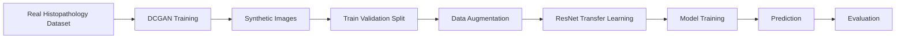
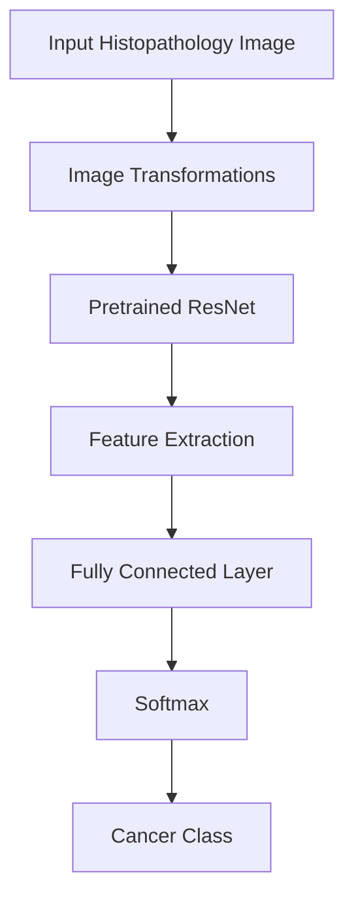

# GAN-Augmented Lung Cancer Classification using Deep Learning

## Overview

This project investigates the effectiveness of **synthetically generated histopathological images** for training deep learning models in lung cancer classification.

A Deep Convolutional Generative Adversarial Network (DCGAN) is first used to generate synthetic lung tissue images belonging to different cancer categories. These generated samples are then used to train a transfer-learning-based convolutional neural network (ResNet), which is evaluated on real histopathological lung cancer images.

The primary goal is to determine whether GAN-generated medical images can alleviate data scarcity challenges and improve classification performance in computational pathology.

---

## Motivation

Medical image datasets are often:

* Expensive to collect
* Difficult to annotate
* Imbalanced across disease classes
* Restricted by privacy concerns

Generative models such as DCGANs provide a promising approach for synthesizing realistic medical images that can supplement limited datasets.

This project explores whether synthetic images alone can provide sufficient information for learning meaningful representations of lung cancer tissue patterns.

---

## Problem Statement

Can a deep learning classifier trained on GAN-generated lung histopathological images generalize to real-world lung cancer histopathology data?

The project focuses on three tissue categories:

| Class                   | Description                          |
| ----------------------- | ------------------------------------ |
| Adenocarcinoma          | Malignant glandular lung tissue      |
| Benign                  | Non-cancerous lung tissue            |
| Squamous Cell Carcinoma | Malignant squamous epithelial tissue |

---

## Methodology

The workflow consists of four major stages:

1. Synthetic image generation using DCGAN.
2. Dataset preparation and train-validation-test splitting.
3. Transfer learning with ResNet.
4. Evaluation on real histopathological samples.

### Pipeline



---

## Dataset Preparation

The notebook automatically creates:

```text
train/
│
├── G_adenocarcinoma/
├── G_benign/
└── G_squamous_cell_carcinoma/

val/
│
├── G_adenocarcinoma/
├── G_benign/
└── G_squamous_cell_carcinoma/

test/
│
├── G_adenocarcinoma/
├── G_benign/
└── G_squamous_cell_carcinoma/
```

The generated images are split into:

* Training Set
* Validation Set
* Test Set

using stratified random sampling.

---

## Data Augmentation

To improve model robustness, the following preprocessing steps are applied:

### Training

* Random Resized Crop (224×224)
* Random Horizontal Flip
* Tensor Conversion
* ImageNet Normalization

### Validation & Testing

* Resize
* Center Crop
* Tensor Conversion
* ImageNet Normalization

These augmentations help the model learn invariant tissue representations.

---

## Model Architecture

The classification model is built using **Transfer Learning** with a pretrained ResNet backbone.

### Network Components



### Advantages of Transfer Learning

* Faster convergence
* Better feature extraction
* Reduced training data requirements
* Improved generalization

---

## Training Configuration

The model is trained using:

```python
Batch Size = 32
Input Size = 224 x 224
Optimizer = Adam
Loss Function = CrossEntropyLoss
Framework = PyTorch
```

The notebook automatically utilizes GPU acceleration when available.

---

## Evaluation Metrics

The model is evaluated using multiple classification metrics:

### Accuracy

Measures overall prediction correctness.

### Precision

Measures how many predicted positives are correct.

### Recall

Measures the ability to identify true positive samples.

### F1 Score

Balances precision and recall.

### Confusion Matrix

Provides class-wise performance insights.

---

## Visualization

The notebook generates:

* Training loss curves
* Validation loss curves
* Accuracy plots
* Confusion matrices
* Classification reports

These visualizations help analyze learning behavior and class-specific performance.

---

## Experimental Objective

The central research question explored is:

> Can GAN-generated histopathological images provide sufficient training signal for deep learning models to classify real lung cancer tissue samples?

This investigation contributes to ongoing research in:

* Medical AI
* Computational Pathology
* Data Augmentation
* Synthetic Data Generation
* Deep Learning for Healthcare

---

## Technologies Used

### Deep Learning

* PyTorch
* TorchVision

### Data Processing

* NumPy
* Scikit-Learn

### Visualization

* Matplotlib
* Seaborn

### Machine Learning

* Transfer Learning
* Convolutional Neural Networks
* DCGAN-generated datasets

---

## Installation

Clone the repository:

```bash
git clone https://github.com/yourusername/GAN-Augmented-Lung-Cancer-Classification.git

cd GAN-Augmented-Lung-Cancer-Classification
```

Install dependencies:

```bash
pip install torch torchvision
pip install numpy
pip install matplotlib
pip install seaborn
pip install scikit-learn
```

---

## Running the Notebook

Launch Jupyter Notebook:

```bash
jupyter notebook
```

Open:

```text
GAN-Augmented-Lung-Cancer-Classification.ipynb
```

Run all cells sequentially.

---

## Future Work

Potential extensions include:

* Vision Transformers (ViT)
* EfficientNet architectures
* Diffusion-based synthetic image generation
* Explainable AI using Grad-CAM
* Multi-class histopathological classification
* Cross-dataset validation
* Self-supervised representation learning

---

## Research Impact

This project demonstrates how synthetic medical images can be leveraged to train deep learning models when annotated medical datasets are scarce.

The approach has potential applications in:

* Digital pathology
* Computer-aided diagnosis
* Rare disease detection
* Medical image augmentation
* Resource-constrained healthcare environments

---

## Author

**Yash Tripathi**

Computer Science Engineer | Machine Learning Researcher

Areas of Interest:

* Medical Artificial Intelligence
* Computer Vision
* Generative Models
* Deep Learning for Healthcare
